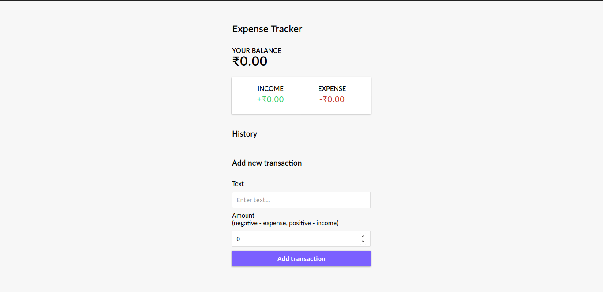

# React Expenses App

React expense tracker created with hooks, making use of the react hooks and getting a hang of useContext and useReducer in place for redux and using the context API with hooks.

[Live Demo](https://react-expenses-tracker.netlify.com/)

# Development

## Available Scripts

In the project directory, you can run:

### `npm start`

Runs the app in the development mode. 
Open [http://localhost:3000](http://localhost:3000) to view it in the browser.

The page will reload if you make edits. 
You will also see any lint errors in the console.

### `npm run build`

Builds the app for production to the `build` folder. 
It correctly bundles React in production mode and optimizes the build for the best performance.

The build is minified and the filenames include the hashes. 
Your app is ready to be deployed!
